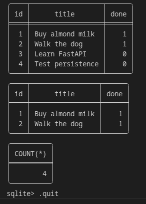
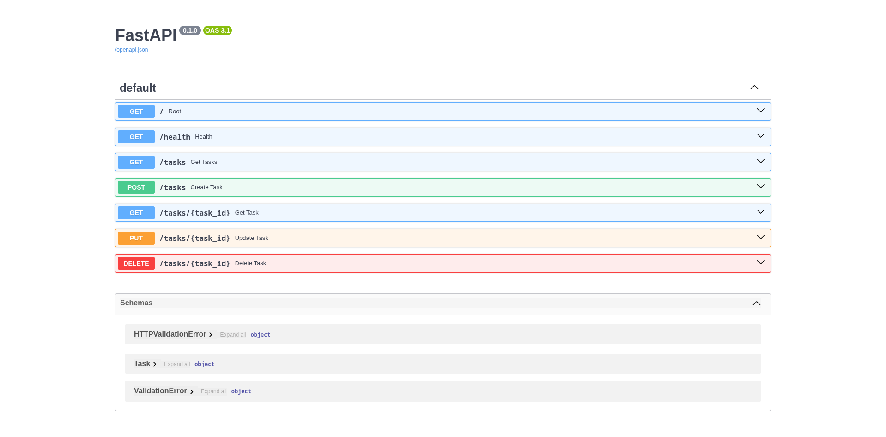

# Task API

A CRUD API for managing a to-do list, built with **Python**, **FastAPI**, and **PostgreSQL** in **Docker Compose**.

## One-Command Quickstart

```bash
# 1. Copy environment variables example
cp .env.example .env

# 2. Start the entire stack (API + Postgres)
docker compose up -d
```

The database (`tasks` inside Postgres container) and table are created automatically on startup. Seed data (3 tasks) is inserted only on first run.

Server runs at `http://localhost:8000`

## Database

- **Engine:** PostgreSQL (runs in a Docker container)
- **Service Name:** `db`
- **Secrets:** Configured via `.env` / `DATABASE_URL`
- **Persistence:** Mounts a named Docker volume (`taskdata`) so data survives container restarts

### Example SQL Query (via Docker)

```bash
docker exec -it crud-db-1 psql -U postgres -d tasks -c "SELECT * FROM tasks WHERE done = true;"
```



## Endpoints

| Method | Endpoint | Description | Status | Auth Required? |
|--------|----------|-------------|--------|----------------|
| GET | `/` | API info | 200 | No |
| GET | `/health` | Health check | 200 | No |
| GET | `/tasks` | List all tasks | 200 | No |
| GET | `/tasks/{id}` | Get single task | 200, 404 | No |
| POST | `/tasks` | Create a task | 201, 422 | No |
| PUT | `/tasks/{id}` | Update a task | 200, 404 | No |
| DELETE | `/tasks/{id}` | Delete a task | 204, 404 | No |
| POST | `/auth/signup` | Create an account | 201, 400 | No |
| POST | `/auth/login` | Authenticate & get tokens | 200, 400, 401 | No |
| POST | `/auth/logout` | End user session | 204 | Yes |
| GET | `/public/info` | Read public data | 200 | No |
| GET | `/protected/profile`| Read private profile data | 200, 401 | Yes |
| GET | `/protected/dashboard`| Read private dashboard | 200, 401 | Yes |

> **Security Note:** Endpoints requiring auth must receive the access token via the `Authorization: Bearer <token>` header. Swagger UI at `/docs` supports this natively via the "Authorize" padlock.

> **Note:** Invalid requests (e.g. empty title) return HTTP `422 Unprocessable Entity` instead of `400`. This is FastAPI + Pydantic's default behavior — `422` is semantically more accurate here since the JSON is well-formed but the content fails validation.
## Example `curl` Output

```
$ curl -i http://localhost:8000/tasks/1

HTTP/1.1 200 OK
date: Tue, 28 Jul 2026 18:30:00 GMT
server: uvicorn
content-length: 40
content-type: application/json

{"id":1,"title":"Buy milk","done":false}
```

## Swagger UI

Interactive API documentation is available at `http://localhost:8000/docs`


